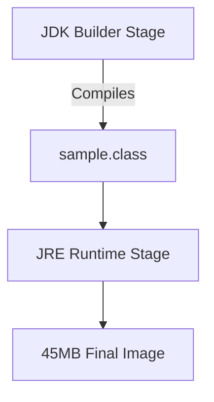

# Dockerized Java Calculator

A simple Java calculator application containerized with Docker, demonstrating multi-stage builds and Alpine Linux optimization.




## Features
- **Multi-stage Docker build** (JDK for compilation → JRE for runtime)
- **Alpine Linux base image** (45MB vs 470MB default)
- **Interactive terminal support** (`-it` flag for user input)
- **Auto-cleanup** (`--rm` flag for container management)

## Installation
1. **Clone the repository**:
   ```bash
   git clone https://github.com/tentinqu/containerized-calculator-.git
   cd containerized-calculator-
   ```

2. **Build the Docker image**:

```bash
docker build -t java-calculator .
```

3. **Usage**:
Run the calculator interactively:

```bash
docker run -it --rm java-calculator
```
Example session:

```text
Enter first number: 5
Enter an operator (+, -, *, /): *
Enter second number: 3
5.0 * 3.0 = 15.0
```
